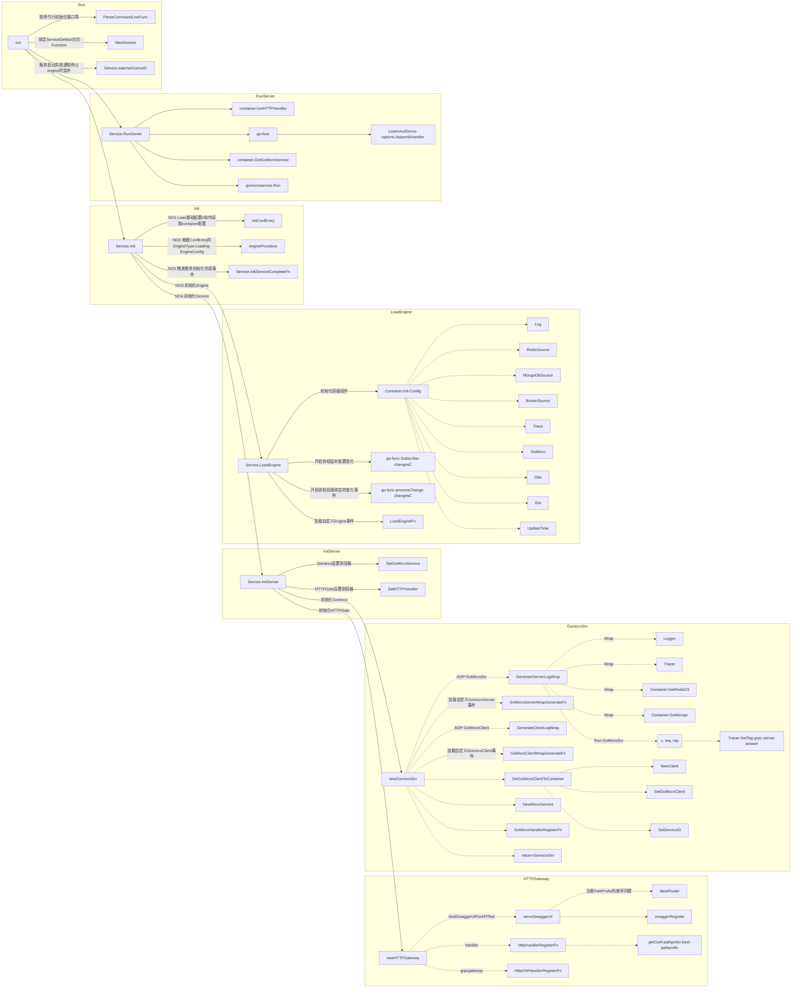

框架调用链路图

```mermaid
graph LR


  subgraph HTTPGateway
  newHTTPGateway-.->|bindSwaggerUIForAPITest|serveSwaggerUI
  	serveSwaggerUI-.->|注意PathPrefix的顺序问题|NewRouter
  	serveSwaggerUI-.->swaggerRegister
  newHTTPGateway-.-> |handler|HttpHandlerRegisterFn
  	HttpHandlerRegisterFn-.-> getConf-pathprefix-bind-pathprefix
  newHTTPGateway-.-> |grpcgateway|HttpGWHandlerRegisterFn
  end

  subgraph GomicroSrv
    newGomicroSrv-.->|AOP-GoMicroSrv|GenerateServerLogWrap
    	GenerateServerLogWrap-.->|Wrap|Logger
    	GenerateServerLogWrap-.->|Wrap|Tracer
    	GenerateServerLogWrap-.->|Wrap|Container.GetRedisCli
    	GenerateServerLogWrap-.->|Wrap|Container.GetMongo
    	GenerateServerLogWrap-.->|Run-GoMicroSrv|fn(c, req, rsp)
    		fn(c, req, rsp)-.->Tracer-SetTag-grpc-server-answer
    newGomicroSrv-.->|加载自定义GomicroServer事件|GoMicroServerWrapGenerateFn
    newGomicroSrv-.->|AOP-GoMicroClient|GenerateClientLogWrap
    newGomicroSrv-.->|加载自定义GomicroClient事件|GoMicroClientWrapGenerateFn
    newGomicroSrv-.-> SetGoMicroClientToContainer
    	SetGoMicroClientToContainer-.->NewClient
    	SetGoMicroClientToContainer-.->SetGoMicroClient
    	SetGoMicroClientToContainer-.->SetServiceID
    newGomicroSrv-.->NewMicroService
    newGomicroSrv-.->GoMicroHandlerRegisterFn
    newGomicroSrv-.->return-GomicroSrv
  end
  
  
  subgraph InitServer
    Service.InitServer-->|初始化Gomirco|newGomicroSrv
    Service.InitServer-->|Gomirco设置到容器|SetGoMicroService
    Service.InitServer-->|初始化HTTPGate|newHTTPGateway
    Service.InitServer-->|HTTPGate设置到容器|SetHTTPHandler
  end
  
  subgraph LoadEngine
    Service.LoadEngine-->|初始化容器组件|Container.Init-Config
    Container.Init-Config-.->Log
    Container.Init-Config-.->RedisSource
    Container.Init-Config-.->MongoDBSource
    Container.Init-Config-.->BrokerSource
    Container.Init-Config-.->Trace
    Container.Init-Config-.->GoMicro
    Container.Init-Config-.->Obs
    Container.Init-Config-.->Ext
    Container.Init-Config-.->UpdateTime
    Service.LoadEngine-->|开启协程监听配置变化|go-func-Subscribe-changesC
    Service.LoadEngine-->|开启协程处理绑定的变化事件|go-func-processChange-changesC
    Service.LoadEngine-->|加载自定义Engine事件|LoadEngineFn
  end
  
  subgraph Init
    Service.Init-->|NO1.Load基础配置#如何读取container配置|initConfEntry
    Service.Init-->|NO2.根据ConfEntry的EngineType-Loading-EngineConfig|engineProvidors
    Service.Init-->|NO3.初始化Engine|Service.LoadEngine
    Service.Init-->|NO4.初始化Service|Service.InitServer
    Service.Init-->|NO5.触发服务初始化完成事件|Service.InitServiceCompleteFn
    
  end
  
  subgraph RunServer
  	Service.RunServer-->container.GetHTTPHandler
  	Service.RunServer-->go-func
  		go-func-->ListenAndServe-options.Apiport&Handler
  	Service.RunServer-->container.GetGoMicroService
  	Service.RunServer-->gomicroservice.Run
  end
  
  subgraph Run
    	run-->|按命令行初始化端口等| ParseCommandLineFunc
    	run-->|绑定ServiceDefalut对应Function| NewService
    	run-->Service.Init
    	run-->Service.RunServer
    	run-->|服务启动失败通知停止engine的监听|Service.watcherCancelC
  end
```

