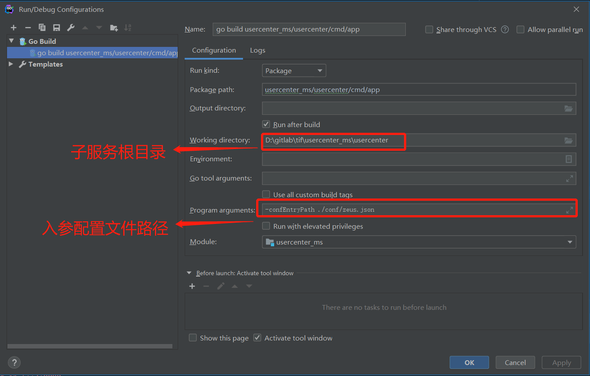

# zeus开发规范

## 目录

- [**框架相关简介**](#框架相关简介)
- [**golang安装**](#golang安装)
- [**zeus配置gomod版本管理**](#zeus配置gomod版本管理)
- [**开发工具**](#开发工具)
- [**组件**](#组件)
- [**环境变量**](#环境变量)
- [**项目初始化**](#项目初始化)
- [**项目例子**](#项目例子)
- [**调试**](#调试)
- [**一些代码规范风格**](#一些代码规范风格)
- [**单元测试**](#单元测试)
- [**性能分析**](#性能分析)
- [**git版本分支管理**](#git版本分支管理)
- [**git提交代码**](#git提交代码)

## 框架相关简介
------

- 基于[gomicro](https://github.com/micro/go-micro) [gin](https://github.com/gin-gonic/gin)

## golang安装
------
- [golang](https://golang.google.cn/)，这里使用>=go1.16.x，对gomodule有更完善的支持，详情请参考[安装](https://golang.google.cn/doc/install)
- [镜像](https://goproxy.cn)
- 配置代理

    ```
    go env -w GOPROXY=https://goproxy.cn,direct
    ```

## zeus配置gomod版本管理

### 设置私有库不使用gomod代理

```bash
go env -w GOPRIVATE=github.com/mmqbaba/zeus
```

### 配置go.mod文件

```bash
go mod init zeus-examples
```

注意手动更新replace依赖

```txt
module zeus-examples

go 1.16

replace (
	github.com/golang/lint => golang.org/x/lint v0.0.0-20190313153728-d0100b6bd8b3
	github.com/hashicorp/consul => github.com/hashicorp/consul v1.5.1
	github.com/micro/go-micro => github.com/maidol/go-micro v1.18.1
	github.com/testcontainers/testcontainer-go => github.com/testcontainers/testcontainers-go v0.0.4
	google.golang.org/grpc => google.golang.org/grpc v1.25.1
	github.com/mmqbaba/zeus => github.com/mmqbaba/zeus v0.6.10
)

```

执行module tity

```bash
go mod tidy
```

## 开发工具
------
goland or vscode

### vscode

- 安装vscode

- 安装格式化插件 Beautify

- 安装 EditorConfig插件

- 换行, linux 默认 LF, windows 默认 CRLF, 在windows下也设置为LF, 与linux兼容（可通过EditorConfig插件控制）

```javascript
// 在用户设置默认
// 默认行尾字符。使用 \n 表示 LF，\r\n 表示 CRLF。
{ "files.eol": "\n"}
```

### goland环境配置

- goland版本需要 >= `GoLand 2019.2.5`

- Run or Debug Configuration



## 组件
------

部分工具包放在[tools](http://github.com/mmqbaba/zeus-examples/tree/master/tools)
  
### etcd v3

框架只支持v3版本(>=v3.2)的etcd

#### 下载
- 地址
```
https://github.com/etcd-io/etcd/releases
```
- 根据操作系统下载对应的安装包
- 解压
- 测试
```
./etcd --version
```
```
ETCDCTL_API=3 ./etcdctl version
```
#### 启动
- 设置环境变量
```
ETCDCTL_API=3
```
- 启动服务
```
./etcd
```
#### 测试
- 设置和获取值
```
./etcdctl put /mykey "this is awesome"
```
```
./etcdctl get /mykey
```
#### Web 管理工具
```
https://github.com/evildecay/etcdkeeper/releases
```

#### docker安装方式
```
docker run -itd --name etcd-3.4.3 -p 2379:2379 gcr.io/etcd-development/etcd:v3.4.3 /usr/local/bin/etcd --listen-client-urls http://0.0.0.0:2379 --advertise-client-urls http://0.0.0.0:2379 
docker run -it -d --name etcdkeeper -p 8080:8080 evildecay/etcdkeeper

```

### mingw64

windows下需要安装此工具包。安装包在[zeus-examples](http://github.com/mmqbaba/zeus-examples)项目，tools/mingw64_x86_64-4.8.2-release-posix-seh-rt_v3-rev2.7z。解压缩后设置目录'mingw64\bin'到path变量。复制'mingw64\bin\mingw32-make.exe'，并重命名为'mingw64\bin\make.exe'

### 日志组件

[logrus](https://github.com/sirupsen/logrus)

### 数据库

### 数据校验

## 环境变量 
------
- GOMAXPROCS cpu核数

## 项目初始化
------
([gen-zeus](http://github.com/mmqbaba/zeus/tree/master/tools/gen-zeus))

### 安装etcd和mingw64

安装方法参考[组件](http://github.com/mmqbaba/docs/blob/master/zeus/framework/%E4%BD%BF%E7%94%A8%E8%A7%84%E8%8C%83.md#%E7%BB%84%E4%BB%B6)

### 安装protoc

使用提供的[二进制执行文件protoc](http://github.com/mmqbaba/zeus-examples/blob/master/tools/protoc-3.7.1-win64.7z)，解压缩并打开文件夹会看到`bin`和`include`目录，设置目录`bin`到path变量，`include`文件夹必须保留并且与`bin`同级

### 安装gen-zeus工具

以下命令不能正常安装，可直接使用提供的[gen-zeus二进制执行文件](http://github.com/mmqbaba/zeus/tree/master/tools/bin)

```bash
git clone ssh://git@github.com/mmqbaba/zeus.git
cd ./zeus
go build -o tools/bin/ ./tools/gen-zeus
cp tools/bin/gen-zeus $GOPATH/bin/ ## 保证$GOPATH/bin已经设置在path变量中(必须在GoPath下,如果错放在GoRoot下,build时会失败)
```

###  安装 protoc-gen-* plugin和gotests

直接使用提供的[二进制执行文件](http://github.com/mmqbaba/zeus-examples/tree/master/tools/protoc-gen)，windows版本的文件复制后需要把`.exe`后缀加上

```bash
# 或使用以下命令安装
go get github.com/golang/protobuf/protoc-gen-go@v1.3.2
go get github.com/micro/protoc-gen-micro@v1.0.0
go get github.com/grpc-ecosystem/grpc-gateway/protoc-gen-grpc-gateway@v1.12.0
go get github.com/grpc-ecosystem/grpc-gateway/protoc-gen-swagger@v1.12.0
go get github.com/mwitkow/go-proto-validators/protoc-gen-govalidators@v0.2.0
go get github.com/favadi/protoc-go-inject-tag@v1.0.0
go get github.com/cweill/gotests/...@v1.5.3
```


### 初始化项目

gen-zeus工具生成的项目目录结构如下，在生成前先了解大概

```txt
./
|-- zeus // 公共库项目（独立git仓库）
|-- zeus-example // 主项目（独立git仓库），可包含多个应用服务
|   -- errdef // 错误码
|      -- errcode.go 
|   -- proto // proto文件
|      -- errdef.proto
|      -- hello.proto
|      -- seal.proto
|      -- sealapi.proto 
|   -- hello
|   -- seal
|   -- sealapi
```
```txt
每个应用服务的分层请求流向: {http,rpc} => handler => logic => resource
./hello
|-- conf
|   -- zeus.json  // 启动配置入口
|-- global        // 一些全局变量，方法函数，初始化
|   -- global.go
|-- cmd
|   -- app        // 应用启动入口
|      -- main.go
|      -- init.go
|-- rpc          // rpc服务handler注册
|   -- rpc.go
|   -- init.go
|-- http         // http服务handler注册，路由定义
|   -- http.go
|   -- init.go
|-- handler  // rpc/http请求的处理逻辑
|-- logic    // 业务逻辑层，根据业务复杂度决定是否需要分层
|-- proto    // proto
|-- resource // 远程资源访问（可根据实际需求，是否要抽到上一层目录，作为各个应用服务的共有依赖）
|   -- dao // 数据库访问
|   -- cache
|   -- httpclient
|   -- rpcclient // 微服务间调用
|   -- broker
|-- Dockerfile
|-- Makefile
|-- README.md
```

第一步：定义proto `hello.proto`

```bash
git clone ssh://git@github.com/mmqbaba/zeus.git # 若当前目录已经存在zeus项目则跳过这步
mkdir zeus-example # 主项目目录
cd zeus-example
mkdir proto # 项目proto目录
touch proto/hello.proto # 文件内容参考下面
```

```proto
// hello.proto
// message, service的命名必须大写开头，驼峰式
syntax="proto3";

package hello;

import "google/api/annotations.proto";
import "github.com/mwitkow/go-proto-validators/validator.proto";
import "protoc-gen-swagger/options/annotations.proto";

option (grpc.gateway.protoc_gen_swagger.options.openapiv2_swagger) = {
    base_path: "/";
    schemes: HTTP;
    info: {
		title: "hello";
        version: "1.0";
	};
};

message HelloRequest{
    string name = 1;
    // @inject_tag: form:"age" binding:"required,gt=20,lt=27"
    int32 age = 2 [(validator.field) = {int_gt: 20, int_lt: 27}];
}

message HelloReply{
    string message=1;
}

message PingRequest{
    string ping = 1;
}

message PongReply{
    string pong = 1;
}

service Hello{
    rpc SayHello(HelloRequest) returns (HelloReply){
        option (google.api.http) = {
            post: "/v1/hello"
            body: "*"
            };
    }

    rpc PingPong(PingRequest) returns (PongReply){
        option (google.api.http) = {
            post: "/v1/pingpong"
            body: "*"
            };
    }
}
```
```proto
// errdef.proto
syntax="proto3";

package errdef;

// 每个子项目特有的错误码定义，避免使用 0 ~ 19999，与公共库冲突
enum ErrCode {
    // 只是用做占位
    OKHolder = 0;

    // helloservice
    ECodeHelloServiceErr = 20001; // hello err^http.StatusInternalServerError
    
    // sealservice
    ECodeHelloServiceNil = 30001; // it was nil^http.StatusInternalServerError
}
```

第二步：初始化应用服务
```bash
gen-zeus --proto ./proto/hello.proto
cd hello
./build-proto.sh #  若提示某些proto文件找不到，打开build-proto.sh文件，在`protoc`命令后添加参数`-I../../../zeus/proto/third_party \`，再尝试
```

第三步：初始化配置

```json
// 设置配置入口文件
// 默认路径为程序当前运行目录'./conf/zeus.json'
// 启动应用时，可通过 '--confEntryPath' 指定
// config_path 服务应用的具体配置路径
// config_format 配置格式
{
    "engine_type": "etcd",
    "config_path": "/zeus/zeus-example/hello",
    "config_format": "json",
	"endpoints": ["127.0.0.1:2379"],
	"username": "root",
	"password": ""
}
```

注意：下面的etcd配置操作，为避免设置失败，请严格按照不同操作系统使用不同的终端进行设置

```bash
# linux
# 设置应用服务配置
# 设值
# 在etcdctl命令工具所在文件目录运行
ETCDCTL_API=3 ./etcdctl put /zeus/zeus-example/hello '{\"go_micro\":{\"service_name\":\"hello\",\"registry_plugin_type\":\"etcd\",\"registry_addrs\":[\"127.0.0.1:2379\"],\"registry_authuser\":\"root\",\"registry_authpwd\":\"\"},\"mongodb\":{\"host\":\"127.0.0.1:27017\",\"user\":\"root\",\"pwd\":\"123456\"},\"mysql_source\":{\"e_seal\":{\"datasourcename\":\"root:123456@tcp(localhost:3306)/e_seal\",\"maxidleconns\":30,\"maxopenconns\":1024}},\"redis\":{\"host\":\"127.0.0.1:6379\",\"pwd\":\"\",\"enable\":false},\"log_conf\":{\"log\":\"console\",\"level\":\"debug\",\"format\":\"text\",\"rotation_time\":\"hour\",\"log_dir\":\"./\"},\"ext\":{\"httphandler_pathprefix\":\"\",\"grpcgateway_pathprefix\":\"\"}}'
```

```bat
# windows powershell
# 设置应用服务配置
# 设值
# 在etcdctl命令工具所在文件目录运行
PS C:\Users\Administrator> $Env:ETCDCTL_API=3
PS C:\Users\Administrator> ./etcdctl put /zeus/zeus-example/hello '{\"go_micro\":{\"service_name\":\"hello\",\"registry_plugin_type\":\"etcd\",\"registry_addrs\":[\"127.0.0.1:2379\"],\"registry_authuser\":\"root\",\"registry_authpwd\":\"\"},\"mongodb\":{\"host\":\"127.0.0.1:27017\",\"user\":\"root\",\"pwd\":\"123456\"},\"mysql_source\":{\"e_seal\":{\"datasourcename\":\"root:123456@tcp(localhost:3306)/e_seal\",\"maxidleconns\":30,\"maxopenconns\":1024}},\"redis\":{\"host\":\"127.0.0.1:6379\",\"pwd\":\"\",\"enable\":false},\"log_conf\":{\"log\":\"console\",\"level\":\"debug\",\"format\":\"text\",\"rotation_time\":\"hour\",\"log_dir\":\"./\"},\"ext\":{\"httphandler_pathprefix\":\"\",\"grpcgateway_pathprefix\":\"\"}}'
```

第四步：启动服务

```bash
go run ./cmd/app # 运行前etcd和mingw64需要安装好，参考[组件]栏
```

浏览器打开链接[swagger-ui](http://localhost:8081/swagger-ui/)

编译打包程序

```bash
make build
```

## 项目例子
------
[zeus-examples](http://github.com/mmqbaba/zeus-examples)

## 调试
------
vscode开发环境下, f5

## 一些代码规范风格
------

- [官方](https://golang.google.cn/doc/effective_go.html)
- [uber](https://github.com/xxjwxc/uber_go_guide_cn)

## 单元测试
------

[gotests工具](https://github.com/cweill/gotests)可快速生成测试模板

对于一些关键代码最好附加上单元测试

- 单元测试

[代码示例](http://github.com/mmqbaba/zeus/blob/master/errors/error_test.go) [示例1](http://github.com/mmqbaba/zeus-examples/blob/master/sample/sample_test.go) [示例2](http://github.com/mmqbaba/zeus-examples/blob/master/sample/handler/sample_sayhello_test.go)

```bash
go test -v
go test -v -run=${regx} # ${regx} 指定测试符合正则的测试函数
```

- 基准测试(衡量/优化性能)

```bash
go test -v -bench=.
go test -v -bench=. -benchmem # -benchmem 内存分配情况, 频繁的内存分配会影响性能
## 性能剖析
go test -v -cpuprofile=cpu.out
go test -v -blockprofile=block.out
go test -v -memprofile=mem.out
## 剖析net/http
go test -v -run=NONE -bench=ClientServerParallelTLS64 -cpuprofile=cpu.log net/http
go tool pprof -text -nodecount=10 ./http.test cpu.log
```

- 代码覆盖率

```bash
go test -v -cover
go test -coverprofile=c.out # 只统计代码是否被运行过
go test -coverprofile=c.out -covermode=count # -covermode=count 统计代码的运行权重
go tool cover -html=c.out # 查看覆盖率报告
```

## 性能分析
------

- pprof工具

## git版本分支管理
------

- 

## git提交代码
------

- 添加必要的提交描述(功能, bug相关)

- 先拉取, 检查语法, 再推送
