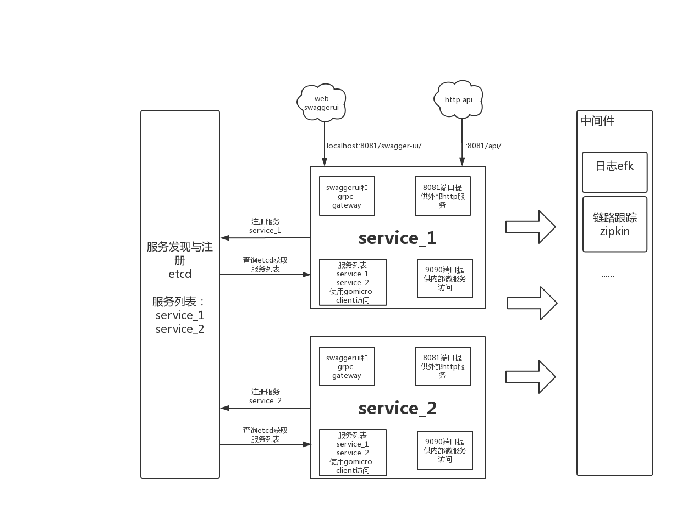

# zeus开发框架

## 简介
---

框架基于gomicro微服务框架，微服务间通信使用grpc，同时对外部提供http服务。为方便测试微服务api接口，内部集成了grpc-gateway和swaggerui。

### [简介图最新地址](https://www.processon.com/view/link/5dd500f2e4b050ff66a0d3c9)

### [Roadmap最新地址](https://www.processon.com/view/link/5dea5878e4b0dba261508680)

